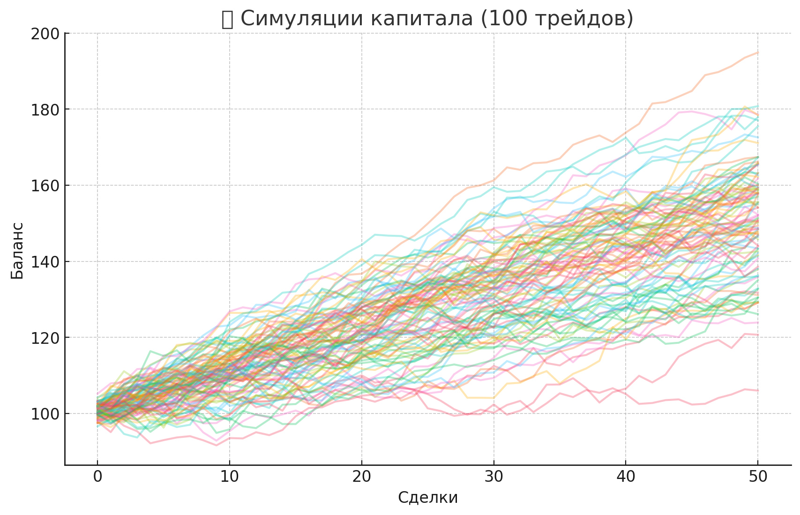
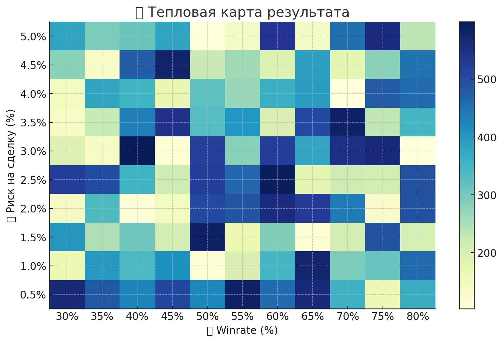

# 🎲 Monte Carlo Trade Simulator

**📈 Приложение для симуляции сделок по трейдинговой стратегии.**

Модель позволяет оценить, как может вести себя депозит в зависимости от winrate, риска, соотношения прибыли/убытка и других параметров. Особенно полезно для трейдеров, системных инвесторов и риск-менеджеров.

▶️ **Попробовать в браузере (без установки):**  
👉 [https://montecarlo-app.streamlit.app/](https://montecarlo-app.streamlit.app/)

---

## 🖼️ Превью

### 1. Симуляции капитала
Показывает, как ведёт себя капитал при 100 симуляциях стратегии:



---

### 2. Тепловая карта риска и winrate
Оценивает, как меняется результат стратегии при разных параметрах:



---

## ⚙️ Возможности

✅ Поддержка до **10 000 симуляций**  
✅ Ввод начального баланса, риска, winrate, RR  
✅ Учёт **ликвидаций** (при падении ниже заданного порога)  
✅ Расчёт **максимальной просадки**, среднего результата и отклонений  
✅ **Экспорт результатов** в CSV  
✅ Интерактивные графики: лучшие/худшие симуляции, гистограммы, тепловые карты  
✅ **Анимированная визуализация** капитала

---

## 📤 Как запустить у себя

1. Установи зависимости:

```bash
pip install streamlit matplotlib numpy pandas
Запусти приложение:

bash
Копировать
Редактировать
streamlit run montecarlo_app.py
📚 Почему это важно трейдеру
Монте-Карло симуляция позволяет:

Проверить устойчивость стратегии к вероятностным отклонениям

Оценить частоту и глубину просадок

Смоделировать поведение капитала в долгосрочной перспективе

Найти оптимальные параметры риска и winrate

📄 Лицензия
MIT — используй и адаптируй под свои задачи свободно.

Автор: @catmellan
💬 По вопросам — создай issue или пиши мне
